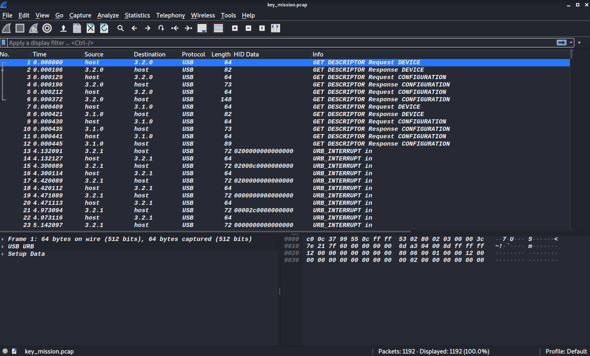
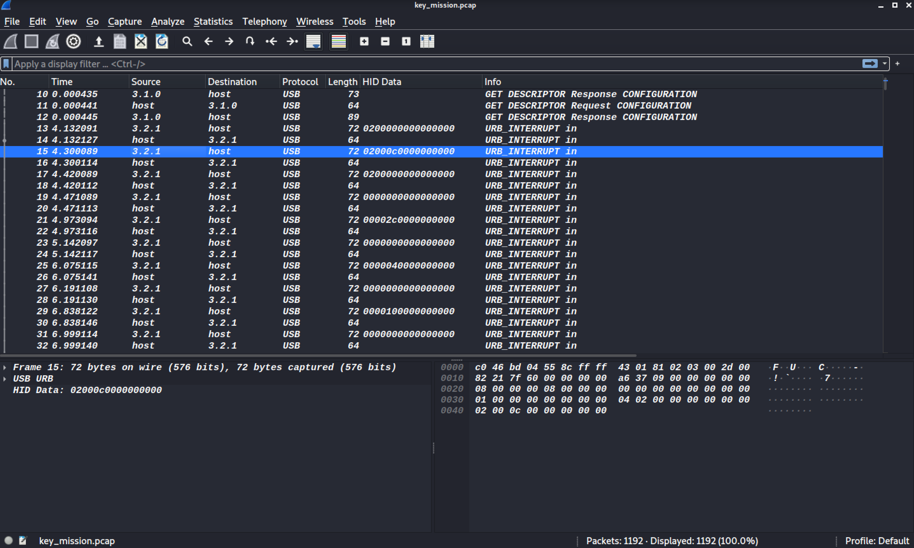

# Forensics Challenges

### Index
___
1. [Key Mission](#key-mission)

### Key Mission
This was one of my most favourite challenges from the event. We were given a pcap file of USB traffic.

The following resources were really helpful in understanding and solving this challenge.
1. [https://book.hacktricks.xyz/forensics/pcaps-analysis/usb-keyboard-pcap-analysis](https://book.hacktricks.xyz/forensics/pcaps-analysis/usb-keyboard-pcap-analysis)
2. [https://medium.com/@ali.bawazeeer/kaizen-ctf-2018-reverse-engineer-usb-keystrok-from-pcap-file-2412351679f4](https://medium.com/@ali.bawazeeer/kaizen-ctf-2018-reverse-engineer-usb-keystrok-from-pcap-file-2412351679f4)

As highlighted in article 2, the `transfer_type` specifies how data is transferred from USB. There are 4 modes:- `isochronous(0x0), interrupt(0x1), control(0x2) and bulk(3)`.

In the interrupt mode, the field `HID Data` is an 8 byte value containing the keys pressed.
- `LeftShift` is indicated by the value `0x02` in the first byte.
- The remaining keys are indicated by the value in the third byte 
- By referring [https://usb.org/sites/default/files/hut1_22.pdf#chapter.100](https://usb.org/sites/default/files/hut1_22.pdf#chapter.10)
we identify the key pressed in the following image is `'I'`


Using the information we can develop a script to get the flag. I used the super helpful `scapy` library to easily read the entire pcap and map the keys pressed.
```python
#!/usr/bin/python3

import re
from scapy.all import *

keymap = {
    0: "", #reserved
    2: "PostFail",
    4: "a",
    5: "b",
    6: "c",
    7: "d",
    8: "e",
    9: "f",
    10: "g",
    11: "h",
    12: "i",
    13: "j",
    14: "k",
    15: "l",
    16: "m",
    17: "n",
    18: "o",
    19: "p",
    20: "q",
    21: "r",
    22: "s",
    23: "t",
    24: "u",
    25: "v",
    26: "w",
    27: "x",
    28: "y",
    29: "z",
    30: "1",
    31: "2",
    32: "3",
    33: "4",
    34: "5",
    35: "6",
    36: "7",
    37: "8",
    38: "9",
    39: "0",
    40: "Enter",
    41: "Escape",
    42: "Delete",
    43: "Tab",
    44: "Space",
    45: "_",
    47: "{",
    48: "}",
    52: ";",
    53: "'",
    54: ",",
    55: ".",
    56: "/",
    57: "CapsLock",
    79: "RightArrow",
    80: "LetfArrow"
}

def get_keystrokes(packets):
    keystrokes = []

    for packet in packets:
        first_byte = packet.load[-8:-7]
        third_byte = packet.load[-6:-5]
        keypressed = keymap[int.from_bytes(third_byte, byteorder="little")]

        if keypressed == "":
            continue

        if first_byte == b'\x02':
            keystrokes.append(keypressed.upper())
        else:
            if keypressed == "Delete":
                keystrokes.pop()
            else:
                keystrokes.append(keypressed)

    return ''.join(keystrokes)

if __name__ == "__main__":
    packets = rdpcap('key_mission.pcap')

    keystrokes = get_keystrokes(packets)
    print("Keyspressed = {}".format(keystrokes))

    flag = re.search(r"CHTB{.*}", keystrokes)[0]
    print("Flag = {}".format(flag))
```
Upon executing the script we get the following output
```shell
$ ./map_keystrokes.py
Keyspressed = bMbISpaceamSpacesendingSpacesecretary;sSpacelocationSpaceoverSpacethisSpacetotallySpaceencryptedSpacechannelSpacetoSpacemakeSpacesureSpacenoSpaceoneSpaceelseSpacewillSpacebeSpaceableSpacetoSpacereadSpaceitSpaceexceptSpaceofSpaceus.SpaceThisSpaceinformationSpaceisSpaceconfidentialSpaceandSpacemustSpacenotSpacebeSpacesharedSpacewithSpaceanyoneSpaceelse.SpaceTheSpacesecretary;sSpacehiddenSpacelocationSpaceisSpaceCHTB{a_plac3_fAr_fAr_away_fr0m_earth}
Flag = CHTB{a_plac3_fAr_fAr_away_fr0m_earth}
```