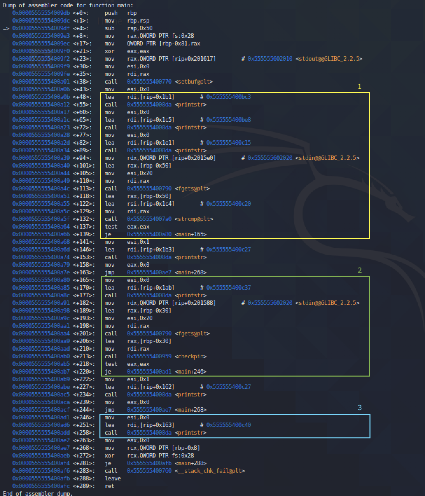
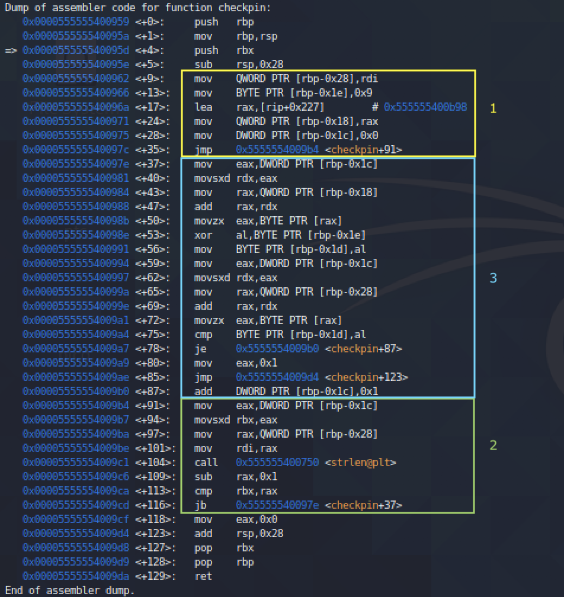
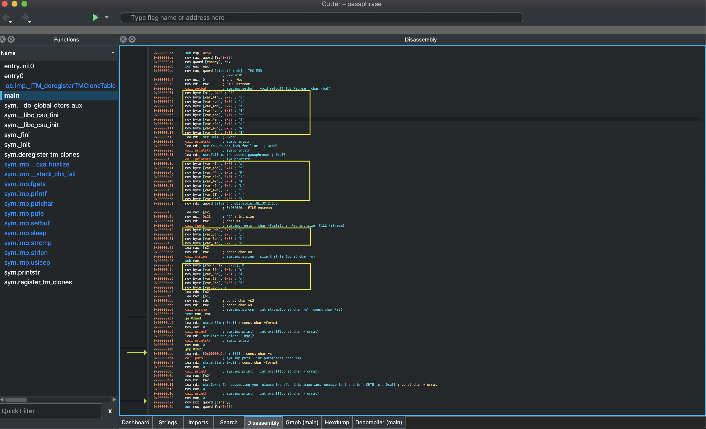

# Reversing Challenges

### Index
___
1. [Authenticator](#authenticator)
2. [Passphrase](#passphrase)

### Authenticator
> We managed to steal one of the extraterrestrial's authenticator device. If we manage to understand how it works and get their credentials, we may be able to bypass all of their security locked doors and gain access everywhere!

Let's first get some info on the binary and then run it.
```shell
$ file authenticator
authenticator: ELF 64-bit LSB pie executable, x86-64, version 1 (SYSV), dynamically linked, interpreter /lib64/ld-linux-x86-64.so.2, for GNU/Linux 3.2.0, BuildID[sha1]=66286657ca5a06147189b419238b2971b11c72db, not stripped

$ ./authenticator

Authentication System 👽

Please enter your credentials to continue.

Alien ID: abcd
Access Denied!

```
I'll walkthrough how to manually reverse this program and in the next challenge we'll look at using [Cutter](https://cutter.re/). Fire up `gdb` and get digging. I have highlighted the three main sections from the `main()` function.

- Section 1:
    - Calls `printstr()` three times, which correspond to the three strings printed respectively at the start of the program.
    ```shell
    (gdb) x/s 0x555555400bc3
    0x555555400bc3: "\nAuthentication System 👽\n\n"
    (gdb) x/s 0x555555400be8
    0x555555400be8: "Please enter your credentials to continue.\n\n"
    (gdb) x/s 0x555555400c15
    0x555555400c15: "Alien ID: "
    ```
    - Calls `fgets()` to take user input.
    - Calls `strcmp()` to check the user input against the string stored in `rsi` register.
    ```shell
    (gdb) x/s 0x555555400c20
    0x555555400c20: "11337\n"
    ```
    - If the check succeeds it goes to section 2, otherwise it makes a call to `printstr()` and returns.
    ```shell
    (gdb) x/s 0x555555400c27
    0x555555400c27: "Access Denied!\n"
    ```

Provide the string `"11337"` as `Alien ID` and rerun the program.
```shell
$ ./authenticator

Authentication System 👽

Please enter your credentials to continue.

Alien ID: 11337
Pin: abcd
Access Denied!

```
We successfully passed the first section. 
- Section 2:
    - Calls `printstr()` which corresponds to the prompt to enter the Pin 
    ```shell
    gdb) x/s 0x555555400c37
    0x555555400c37: "Pin: "
    ```
    - Calls `fgets()` to take user input
    - Calls `checkpin()` function, and proceeds to section 3 if the function returned normally
- Section 3:
    - Calls `printstr()` to print the success message before returning.
    ```shell
    (gdb) x/s 0x555555400c40
    0x555555400c40: "Access Granted! Submit Pin in the flag format: CHTB{fl4g_h3r3}\n"
    ```
Let's analyse the `checkpin()` function.

- Section 1
    - Initialises the variable at `rbp-0x28` with the contents of `rdi` register. Note - `rdi` refers to the first argument of the callee function - which in this case is the `Pin` we inputted.
    ```shell
    (gdb) x/s $rdi
    0x7fffffffdef0: "abcd\n"
    ```
    - Initialises the variable at `rbp-0x1e` with `0x9`.
    - Initialises the variable at `rbp-0x18` with contents of `rax` register.
    ```shell
    (gdb) x/s $rax
    0x555555400b98: "}a:Vh|}a:g}8j=}89gV<p<}:dV8<Vg9}V<9V<:j|{:"
    ```
    - Initialises the variable at `rbp-0x1c` with `0x0`.
- Section 2
    - Extends the value of variable at `rbp-0x1c` to `rbx` register.
    - Calls `strlen()` to determine the length of the input string at `rbp-0x28` and stores it in `rax` register.
    - If `rbp < rax` it goes to section 3, otherwise it returns.
- Section 3
    - Extends the value of variable at `rbp-0x1c` to `rdx` register.
    - Stores the byte at `rbp-0x18` with offset of `rdx` in `al`.
    - Stores the byte from `xor(al, 0x9)` at `rbp-0x1d`.
    - If the byte at `rbp-0x1d == byte at rbp-0x28`, it increments the value at `rbp-0x1c` and repeats the process from section 2.

Thus, to solve the challenge we have to input a `Pin` such that `xor(Pin, 0x9) == "}a:Vh|}a:g}8j=}89gV<p<}:dV8<Vg9}V<9V<:j|{:"`
```python
>>> from pwn import *
>>> xor("}a:Vh|}a:g}8j=}89gV<p<}:dV8<Vg9}V<9V<:j|{:", 0x9)
b'th3_auth3nt1c4t10n_5y5t3m_15_n0t_50_53cur3'
```
Rerun the program with the resulting string obtained on top.
```shell
$ ./authenticator 

Authentication System 👽

Please enter your credentials to continue.

Alien ID: 11337
Pin: th3_auth3nt1c4t10n_5y5t3m_15_n0t_50_53cur3
Access Granted! Submit pin in the flag format: CHTB{fl4g_h3r3}

```
```Flag = CHTB{th3_auth3nt1c4t10n_5y5t3m_15_n0t_50_53cur3}```

### Passphrase
> You found one of their space suits forgotten in a room. You wear it, but before you go away, a guard stops you and asks some questions.

Run the binary provided.
```shell
$ ./passphrase   

Halt! ⛔
You do not look familiar..
Tell me the secret passphrase: abcd

Intruder alert! 🚨
               
```
Open Cutter to analyse the file.

- The highlighted sections just initialise each byte of the string `s1.`
- Thus, `s1 = "3xtr4t3rR3stR14L5_VS_hum4n5"`.
- It then calls `strcmp()` to check if `s1 == input_passphrase`.

Rerun the program with the string obtained.
```shell
$ ./passphrase           

Halt! ⛔
You do not look familiar..
Tell me the secret passphrase: 3xtr4t3rR3stR14L5_VS_hum4n5
✔

Sorry for suspecting you, please transfer this important message to the chief: CHTB{3xtr4t3rR3stR14L5_VS_hum4n5}

```
```Flag = CHTB{3xtr4t3rR3stR14L5_VS_hum4n5}```